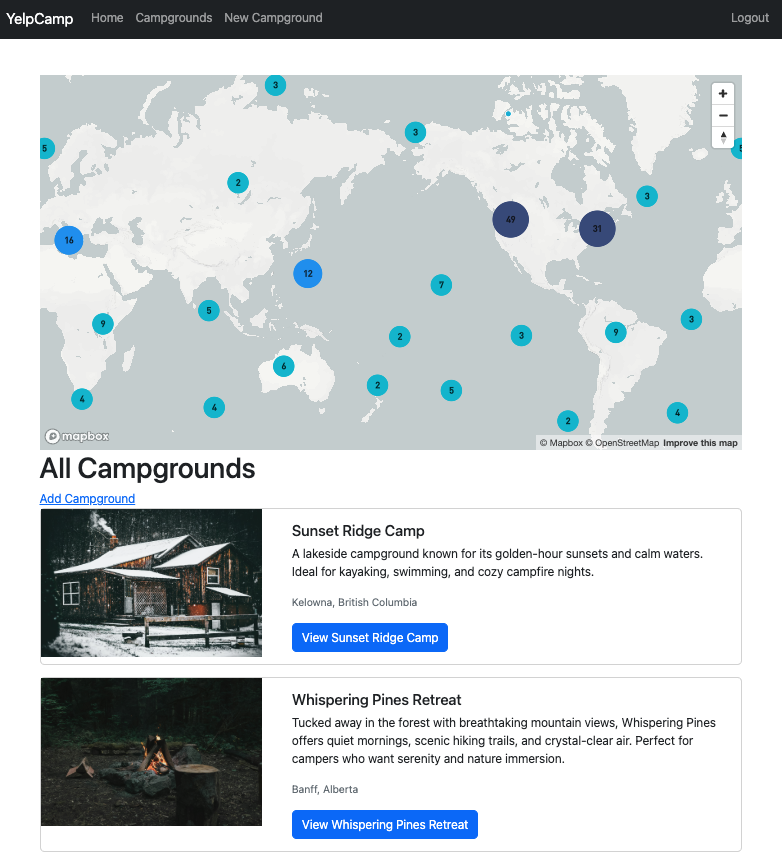
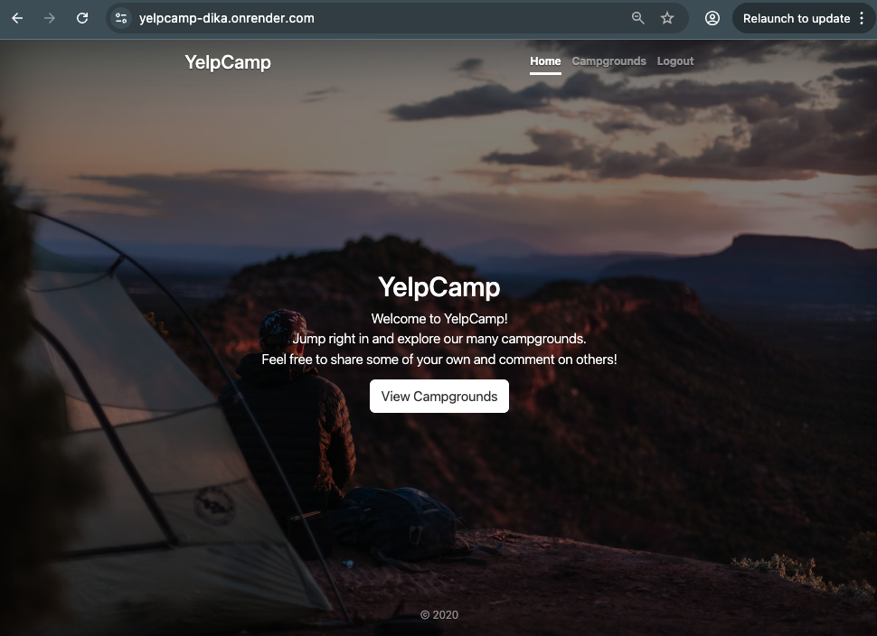
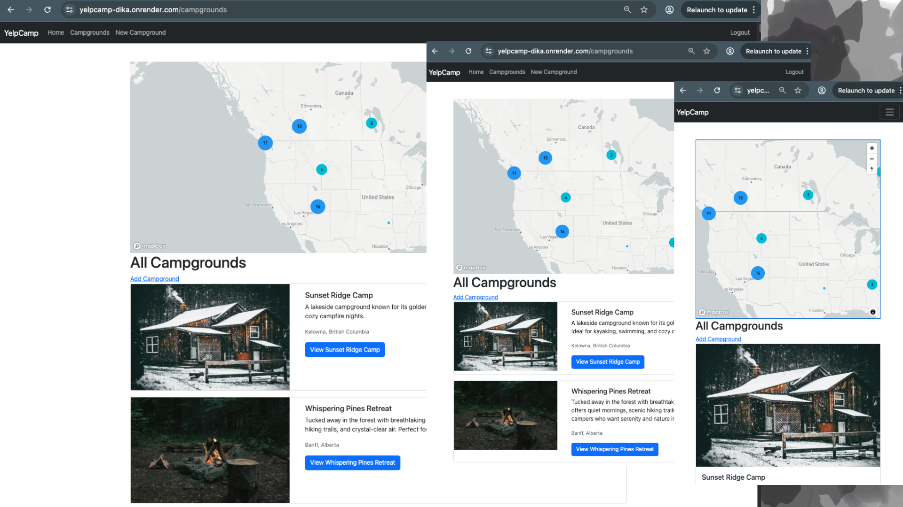
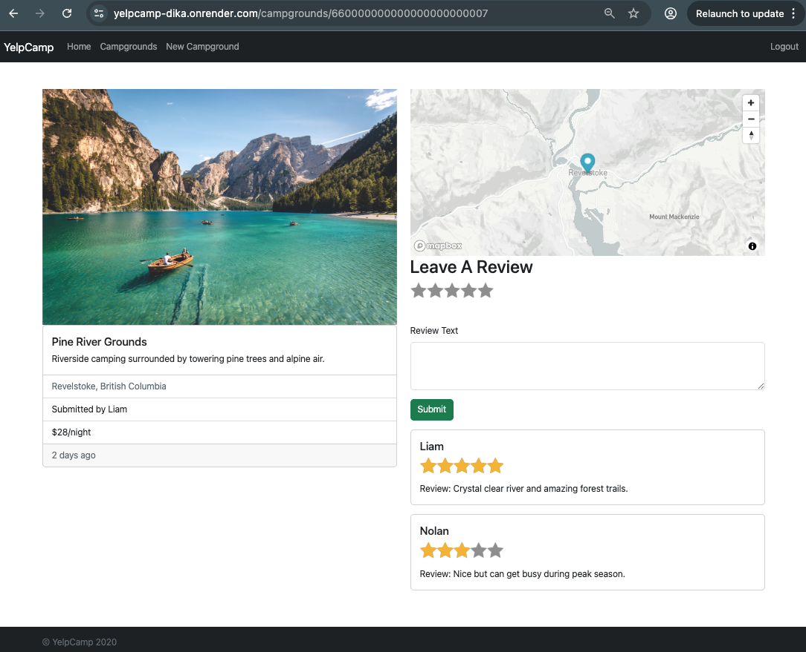
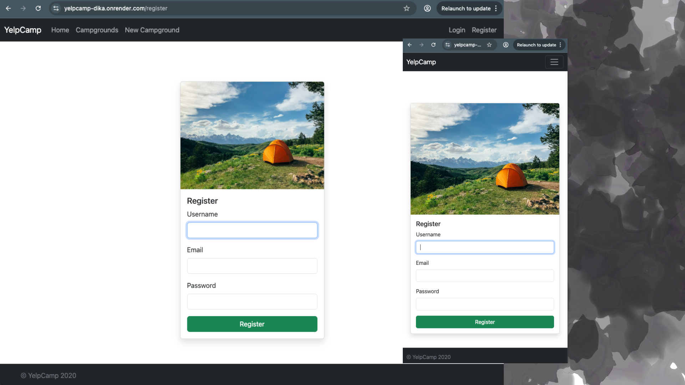

# 🏕️ YelpCamp
Deployed on render: https://yelpcamp-dika.onrender.com (first load might take a while)

A full-stack campground review platform where users can discover, create, and review campgrounds. Built as the capstone project from Colt Steele's Web Developer Bootcamp, equipped with custom features including enhanced UI, image uploads, and interactive maps.



---

## ✨ Features

### For Users
- **Browse campgrounds** with images, descriptions, pricing, and location maps
- **Create an account** with secure registration and login
- **Add campgrounds** with multiple image uploads, descriptions, and pricing
- **Leave reviews** with a 1-5 star rating system
- **Edit and delete** your own campgrounds and reviews
- **Interactive maps** showing campground locations powered by Mapbox

### Security & Validation
- Authentication via Passport.js (local strategy with hashed passwords)
- Authorization — users can only edit/delete their own content
- Server-side input validation with Joi schema validation
- Mongo injection prevention with `express-mongo-sanitize`
- XSS protection with `sanitize-html`
- Session management with secure cookies

---

## 🖼️ Screenshots

### Home Page


### All Campgrounds (with Cluster Map)


### Campground Detail Page


### New Campground Form


### Login / Register


---

## 🔧 Tech Stack

| Layer | Technology | Purpose |
|-------|-----------|---------|
| Frontend | EJS Templates, Bootstrap 5 | Server-rendered pages with responsive design |
| Backend | Node.js, Express | MVC web application with RESTful routing |
| Database | MongoDB, Mongoose | Campground, Review, and User data models |
| Authentication | Passport.js | Local strategy with session-based auth |
| Image Uploads | Cloudinary + Multer | Cloud storage for campground images |
| Maps | Mapbox GL JS | Interactive maps with geocoding |
| Validation | Joi | Server-side schema validation |
| Security | Helmet, express-mongo-sanitize, sanitize-html | HTTP headers, injection & XSS prevention |
| Session Store | connect-mongo | MongoDB-backed session persistence |

---

## 🚀 Getting Started

### Prerequisites

- Node.js 18+
- MongoDB (local or [Atlas](https://www.mongodb.com/atlas) free tier)
- [Cloudinary](https://cloudinary.com/) account (free tier — for image uploads)
- [Mapbox](https://www.mapbox.com/) account (free tier — for maps)

### Installation

```bash
git clone https://github.com/AndikaEsPe/YelpCamp.git
cd yelp-camp
npm install
```

### Environment Setup

Create a `.env` file in the root:

```bash
# Database
MONGODB_URI=mongodb://localhost:27017/yelp-camp

# Cloudinary (from your Cloudinary dashboard)
CLOUDINARY_CLOUD_NAME=your_cloud_name
CLOUDINARY_KEY=your_api_key
CLOUDINARY_SECRET=your_api_secret

# Mapbox (from your Mapbox account)
MAPBOX_TOKEN=your_mapbox_public_token

# Session
SESSION_SECRET=your-session-secret-here

# Server
PORT=3000
```

### Seed the Database (Optional)

```bash
node seeds/index.js
```

This populates the database with sample campgrounds for testing.

### Run

```bash
node app.js
# or with auto-reload:
npx nodemon app.js
```

Visit http://localhost:3000

---

## 🗺️ RESTful Routes

### Campgrounds

| Method | Path | Description |
|--------|------|------------|
| `GET` | `/campgrounds` | List all campgrounds + cluster map |
| `GET` | `/campgrounds/new` | Show create form |
| `POST` | `/campgrounds` | Create campground (auth required) |
| `GET` | `/campgrounds/:id` | Show campground detail + reviews |
| `GET` | `/campgrounds/:id/edit` | Show edit form (author only) |
| `PUT` | `/campgrounds/:id` | Update campground (author only) |
| `DELETE` | `/campgrounds/:id` | Delete campground + reviews (author only) |

### Reviews (nested under campgrounds)

| Method | Path | Description |
|--------|------|------------|
| `POST` | `/campgrounds/:id/reviews` | Create review (auth required) |
| `DELETE` | `/campgrounds/:id/reviews/:reviewId` | Delete review (author only) |

### Users

| Method | Path | Description |
|--------|------|------------|
| `GET` | `/register` | Show registration form |
| `POST` | `/register` | Create account |
| `GET` | `/login` | Show login form |
| `POST` | `/login` | Authenticate user |
| `GET` | `/logout` | End session |

---